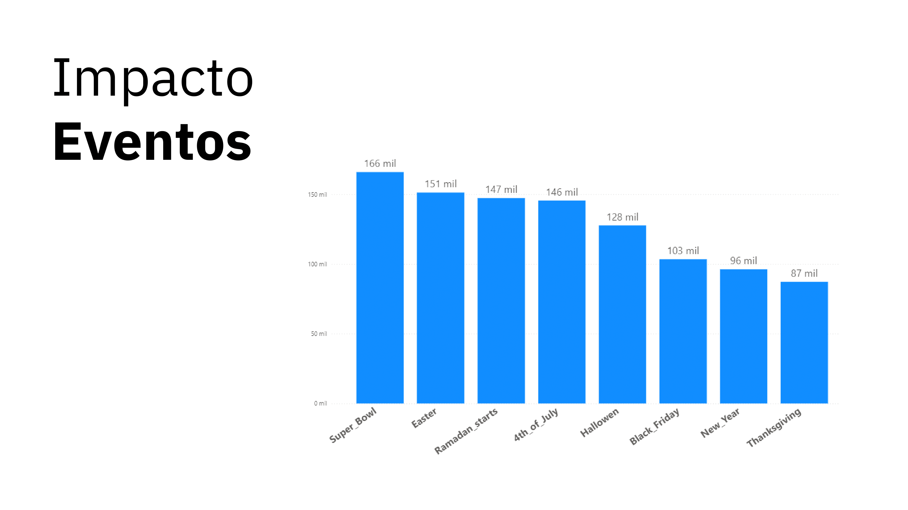
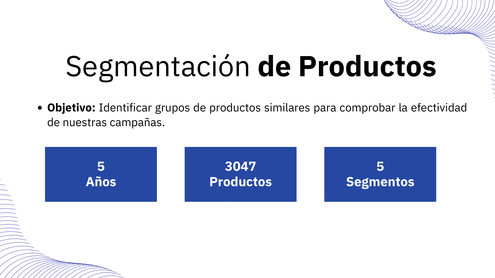
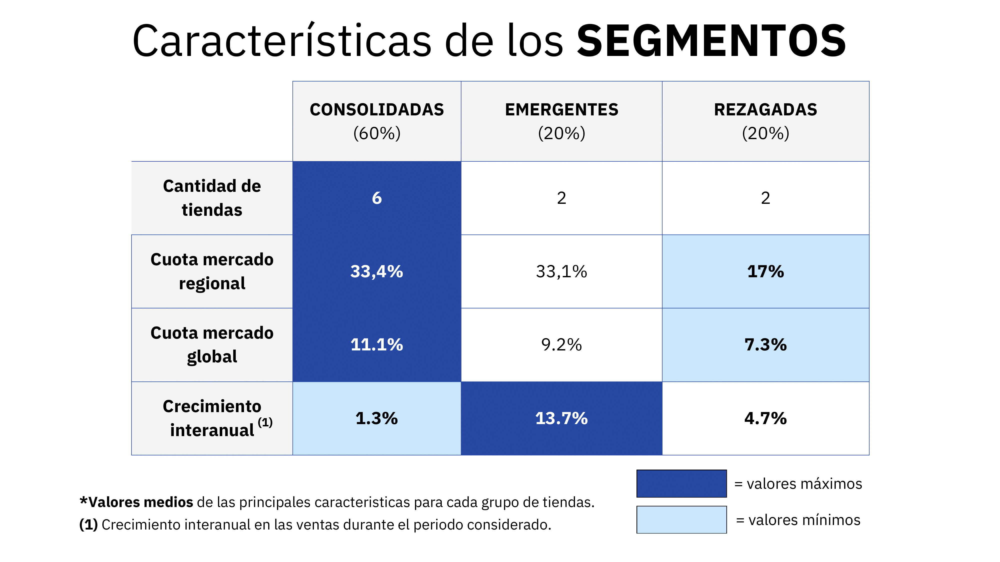

# DS Market - Final Project

This repository contains the final project for my Master's program in Data Science and Artificial Intelligence. The project was structured as a roleplay where my team and I acted as data scientists at **DS Market**, a large retail chain in the USA. Our main task was to help the company become data-driven by achieving three key objectives.

## Project Overview

1. **Business Intelligence**:  
   We created an interactive dashboard in **Power BI** to analyze the company’s current situation, focusing on key business metrics like revenue, sales, and product performance. [View the screenshots of the dashboard here](./business_intelligence/README.md).

2. **Clustering Analysis**:  
   We performed **KMeans clustering** on both **products** and **stores** to group similar items and locations. This helped DS Market to optimize marketing campaigns and product placement based on customer behaviors and sales trends.
   - **Product Clusters**:
     - 5 Segments: Top Sellers, Low Price, High Price, Event Loss, Event Boosted.
     - Performance and price variations were analyzed to identify the most and least successful product groups.
   - **Store Clusters**:
     - 3 Segments: Consolidated, Emerging, Lagging.
     - Regional and global market share, along with sales growth, were used to cluster stores.

3. **Sales Forecasting**:  
   We built multivariate machine learning models to **forecast sales** at a product-store level. These forecasts helped the company plan orders for the next four weeks, using historical sales data. The models predicted key sales metrics, including total units sold and revenue, with performance evaluated by RMSE (Root Mean Squared Error).
   - **Key Findings**:
     - Consolidated stores had the most accurate forecasts with an RMSE of 15.20.
     - Product categories like "Supermarket" had a lower error rate, while "Home & Garden" showed higher variability.
   
   The forecast results were used to evaluate the stock remaining in stores and identify lost sales opportunities due to under-stocking.

## Key Results

- **11.73% CAGR (Compound Annual Growth Rate)** from January 2011 to April 2016.
- Clustering analysis revealed **16% of products as top sellers**, while **23% of stores were lagging** in performance.
- The forecasting models provided valuable insights into demand patterns, allowing for more effective stock and order planning.

## Visuals

1. **Business Intelligence Dashboard**:  
   Check the screenshots [here](./business_intelligence/README.md) to explore the interactive Power BI dashboard.

2. **Data Analysis Visuals**:
   Extracts from DS Market's Data Analysis.
   
   

4. **Clustering and Forecasting Visuals**:  
   Below are images extracted from the project presentation slides to provide visual insights into the results.

   ### Product Clustering
   

   ### Store Clustering
   

   ### Forecasting Overview
   

   ### Forecasting Accuracy Results
   

## Technologies Used

- **Python**: For data analysis and modeling.
- **Pandas, NumPy, Scikit-learn**: For data manipulation and clustering.
- **Power BI**: For business intelligence and dashboard creation.
- **ARIMA, Prophet, XGBoost**: For sales forecasting.
- **Matplotlib, Seaborn**: For data visualization.

---

### How to Navigate the Repository

- **/business_intelligence/**: Power BI screenshots and descriptions of the dashboard.
- **/clustering/**: Code and notebooks for product and store clustering.
- **/forecasting/**: Sales forecasting models and results.
- **/presentation_images/**: Contains images from the project presentation slides.

