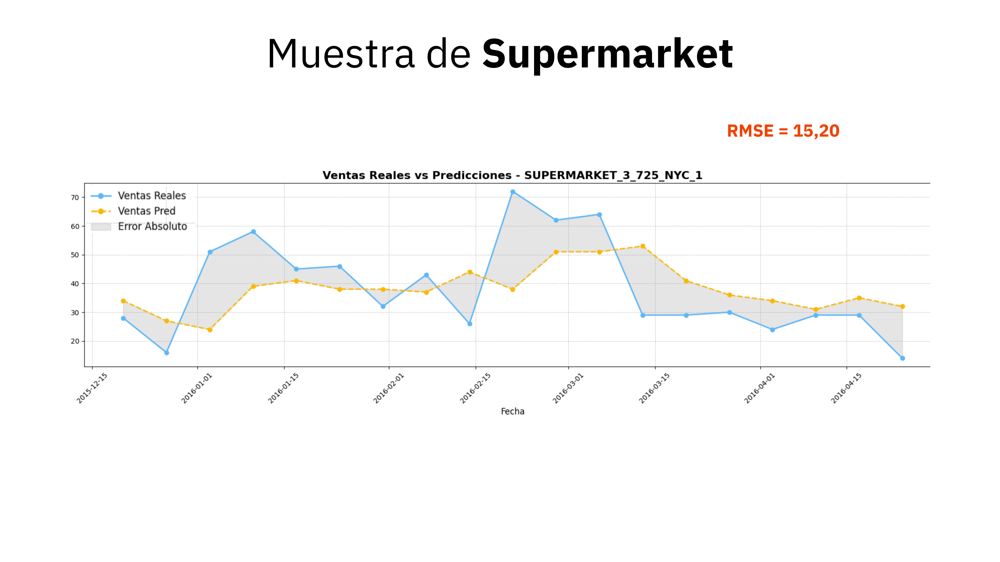

# DS Market - Final Project

This repository contains the final project for my Master's program in Data Science and Artificial Intelligence. The project was structured as a roleplay where my team and I acted as data scientists at **DS Market**, a large retail chain in the USA. Our main task was to help the company become data-driven by achieving three key objectives.

## Project Overview

1. **Business Intelligence**:  
   We created an interactive dashboard in **Power BI** to analyze the company’s current situation, focusing on key business metrics like revenue, sales, and product performance. [View the screenshots of the dashboard here](./business_intelligence/README.md).

2. **Clustering Analysis**:  
   We performed **KMeans clustering** on both **products** and **stores** to group similar items and locations. This helped DS Market to optimize marketing campaigns and product placement based on customer behaviors and sales trends.
   - **Product Clusters**:
     - 5 Segments: Top Sellers, Low Price, High Price, Event Loss, Event Boosted.
     - Performance and price variations were analyzed to identify the most and least successful product groups.
   - **Store Clusters**:
     - 3 Segments: Consolidated, Emerging, Lagging.
     - Regional and global market share, along with sales growth, were used to cluster stores.

3. **Sales Forecasting**:  
   We built a **multivariate machine learning model using XGBoost** to forecast sales at a product-store level. Given the time constraints, we opted for a functional model suitable for a pilot test, ensuring that the model was capable of generating reliable week-by-week predictions. A common issue in such projects is focusing too much on creating a model that performs well for the first week but fails significantly for weeks 2, 3, and 4, leading to inaccurate and inconsistent forecasts. 

   Our approach aimed at keeping the model relatively simple yet robust, ensuring it could generate consistent predictions even beyond the first week. This was a key focus of our work.  
   
   **Future improvements** could involve increasing the model's complexity and the number of features, as well as exploring and comparing alternative models to identify the best-performing one.

   - **Key Findings**:
     - The model globally had an error between **7 and 10 units**, depending on the prediction horizon (with one-week forecasts being more accurate than those for 2, 3, or 4 weeks).
     - The **Supermarket** category had the highest RMSE, with average values between **15 and 20** units.
     - The categories **Home & Garden** and **Accessories** showed much lower RMSEs, around **1 and 4** units.
   
   The forecast results were used to evaluate the stock remaining in stores and identify lost sales opportunities due to under-stocking.

## Key Results

This project enabled DS Market to make significant strides in becoming a data-driven company. The key outcomes include:

- **Advanced Agile Visualization**: The Power BI dashboard empowered DS Market with dynamic, real-time visual insights, drastically enhancing the company's understanding of its business performance and underlying dynamics.
- **Targeted Business Strategies**: The clustering analysis revealed clear behavioral patterns for both products and stores, providing DS Market with actionable insights to design more targeted and effective marketing campaigns and business strategies.
- **Optimized Stock Management**: The sales forecasting model laid the groundwork for a pilot test aimed at optimizing stock management—one of the most critical challenges in the retail industry. By accurately forecasting demand, DS Market can now make informed decisions to reduce lost sales and overstock issues.

## Visuals

1. **Business Intelligence Dashboard**:  
   Check the screenshots [here](./business_intelligence/README.md) to explore the interactive Power BI dashboard.

2. **Data Analysis Visuals**:
   Extracts from DS Market's Data Analysis.
   
   

4. **Clustering and Forecasting Visuals**:  
   Below are images extracted from the project presentation slides to provide visual insights into the results.

   ### Product Clustering
   

   ### Store Clustering
   

   ### Forecasting Overview
   

   ### Forecasting Accuracy Results
   
   
   
   
   

## Technologies Used

- **Python**: For data analysis and modeling.
- **Pandas, NumPy**: For data manipulation and preparation.
- **Scikit-learn**: For clustering analysis using KMeans.
- **XGBoost**: For multivariate sales forecasting.
- **Power BI**: For building interactive dashboards and visualizations.
- **Matplotlib, Seaborn**: For creating data visualizations and analyzing trends.

---

### How to Navigate the Repository

- **/business_intelligence/**: Power BI screenshots and descriptions of the dashboard.
- **/clustering/**: Code and notebooks for product and store clustering.
- **/forecasting/**: Sales forecasting models and results.
- **/presentation_images/**: Contains images from the project presentation slides.

