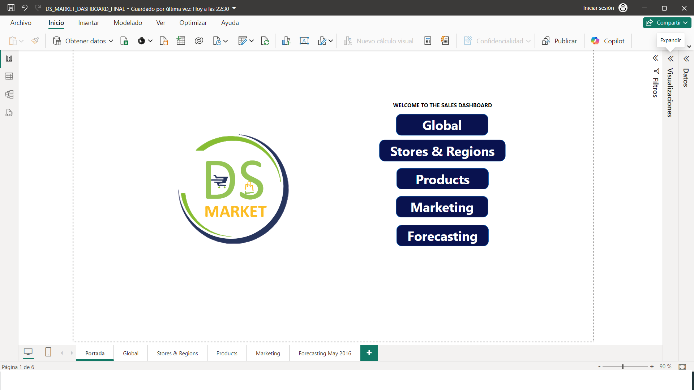
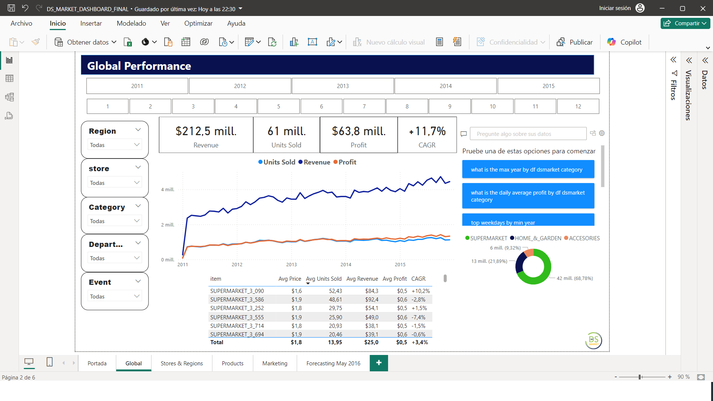
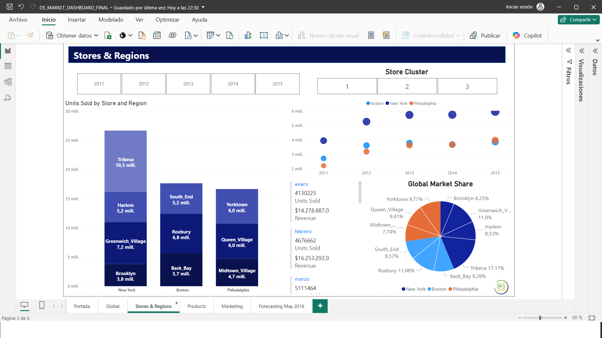
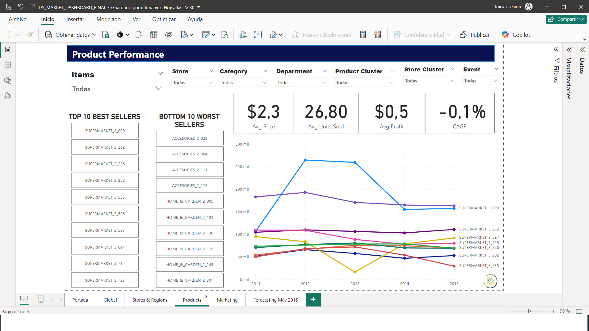
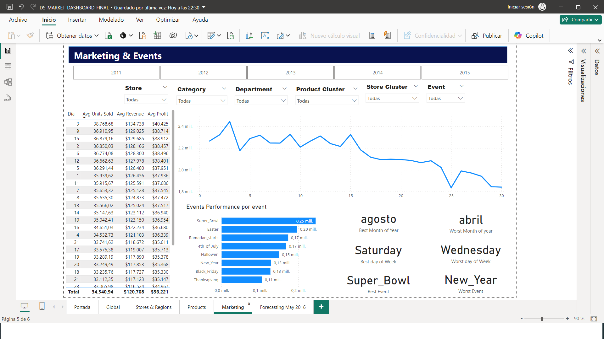
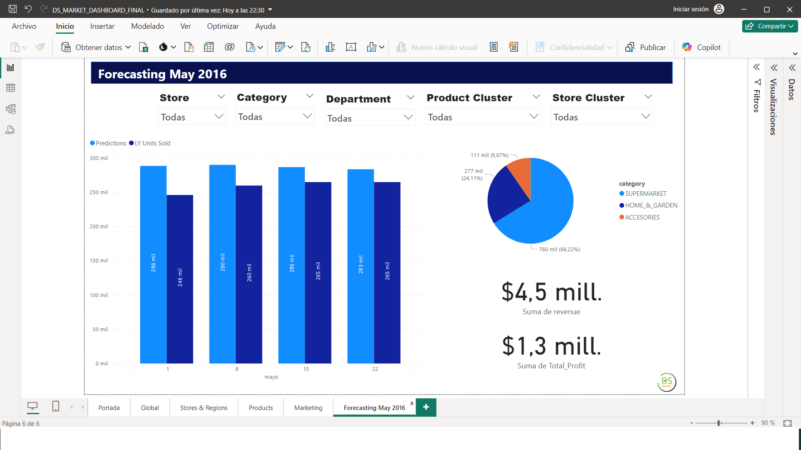

# DS Market - Power BI Dashboard

This section contains screenshots from the Power BI dashboard developed to analyze DS Market's key business metrics. The dashboard provides insights into product performance, marketing events, sales forecasting, and overall store performance.

## 1. Main Dashboard - Welcome Page

## 2. Global Performance
This view presents an overview of the overall business performance of DS Market, including revenue, units sold, and profit across different regions and categories.

## 3. Stores & Regions
This view shows the performance of different stores and regions, including units sold and global market share.

## 4. Product Performance
This view focuses on the best-selling and worst-selling products, including insights into average price, units sold, and profit.

## 5. Marketing & Events
This view analyzes the performance of various marketing events, highlighting the best and worst months and days for sales, and showing revenue generated by key events like Super Bowl and Halloween.

## 6. Sales Forecasting - May 2016
This view provides sales forecasts for different stores and categories for May 2016, helping to plan for inventory and supplier orders.

